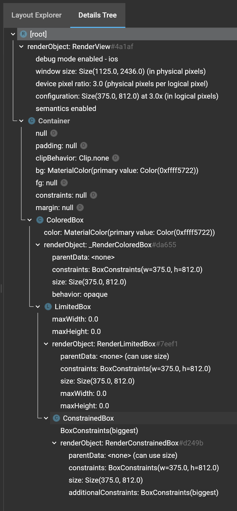

## Minimal app

  ```dart
  void main() {
    runApp(Container(
      color: Colors.deepOrange,
    ));
  }
  ```


### Widgets Tree



### Let's create App as separate StatelessWidget

  ```dart
    void main() {
      runApp(App());
    }
    
    class App extends StatelessWidget {
      @override
      Widget build(BuildContext context) {
        return Container(
          color: Colors.deepOrange,
        );
      }
    }
  ```

App Screen is the same

But the Tree a bit changed

